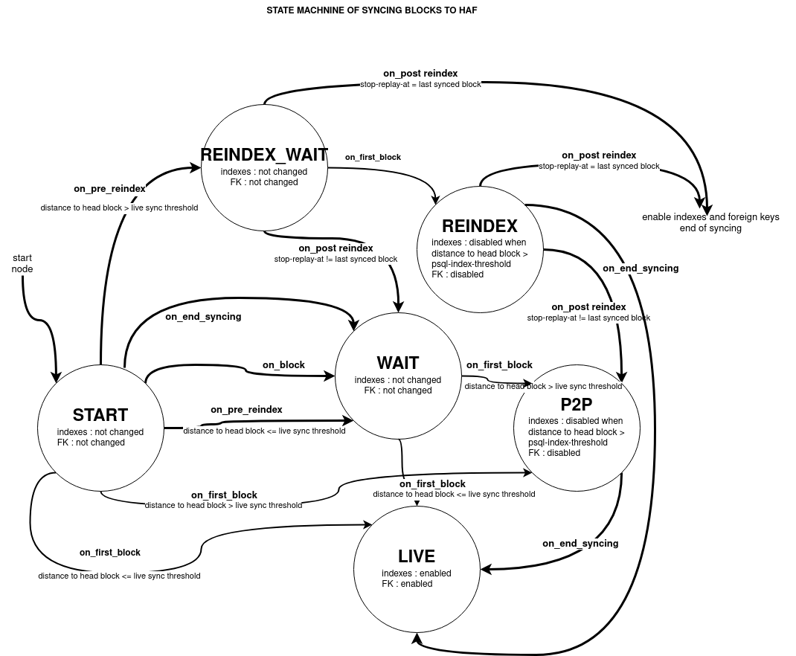
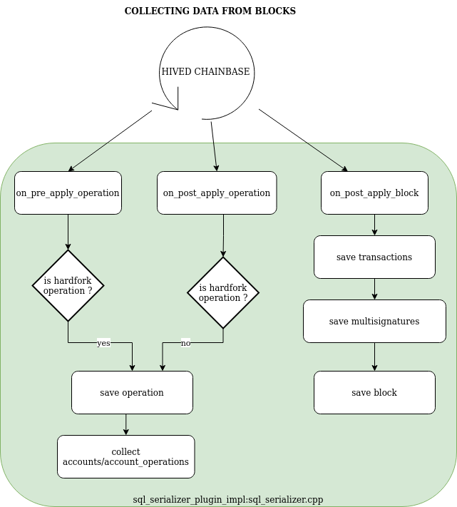
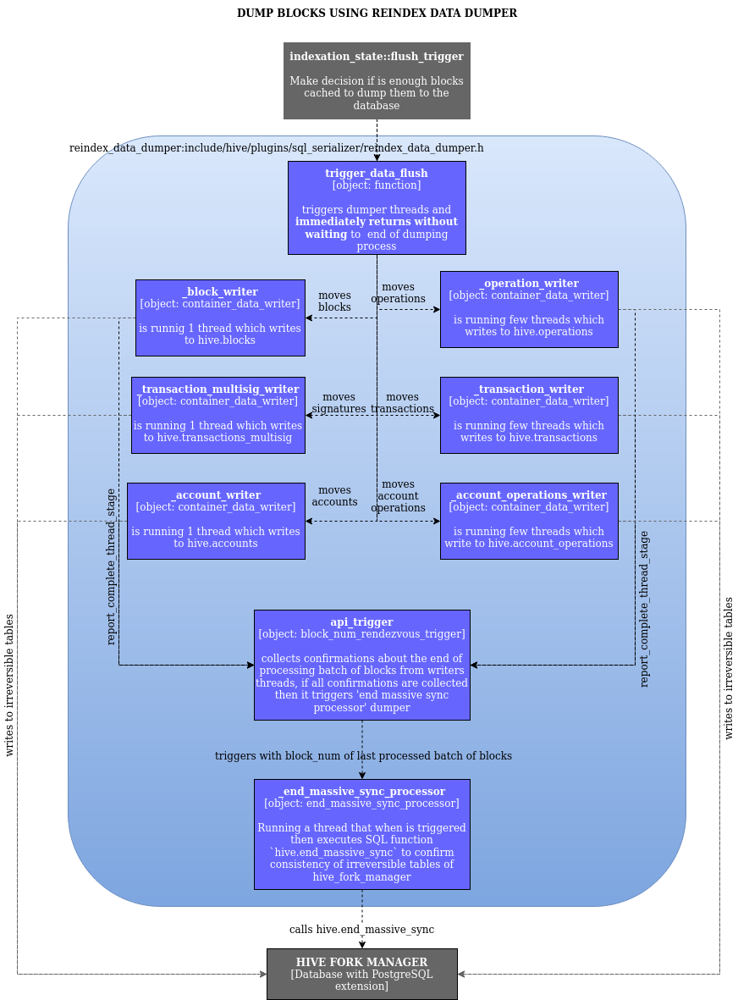
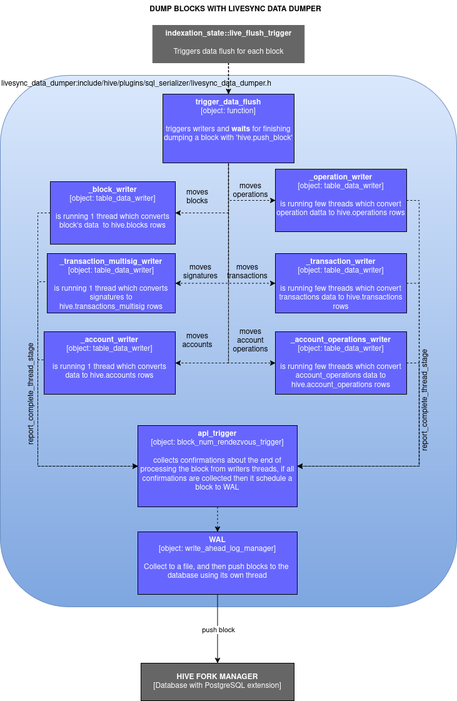

# SQL_SERIALIZER
The sql_serializer is a hived plugin which is responsible for dumping block data to the hive_fork_manager and informs it about the occurence of important events related to block processing (for example, when a block becomes irreversible or when a micro-fork occurs that reverts blocks that have been added to the HAF database).

## Build
Like other hived plugins, the sql_serializer is compiled during compilation of the hived program itself.
There is a trick which allows for this: cmake scripts create a symbolic
link to sql_serializer sources in `hive/libraries/plugins`, then the cmake script of the hive submodule finds the plugin's sources together with sql_serializer by following the symbolic link.

## Setup
You need to add the sql_serializer plugin and associated parameters to the hived node's `config.ini` file to enable the plugin.

```
plugin = sql_serializer
psql-url = dbname=block_log user=my_hived_role password=pass hostaddr=127.0.0.1 port=5432
psql-index-threshold = 1000000
psql-operations-threads-number = 5
psql-transactions-threads-number = 2
psql-account-operations-threads-number = 2
psql-enable-account-operations-dump = true
psql-force-open-inconsistent = false
psql-livesync-threshold = 100000
```

## Parameters
The sql_serializer extends hived with these new parameters:
* **psql-url** contains information needed to connect to the HAF database
    - *dbname* name of the HAF database on the PostgreSQL cluster
    - *user* a Postgres role name used to connect to the database (by default it should be a hived builtin role)
    - *hostaddr* an internet address of the PostgreSQL cluster
    - *port* a TCP port on wich the PostgreSQL cluster is listening

  ```
  Example:
  psql-url = dbname=block_log user=my_hived_role password=pass hostaddr=127.0.0.1 port=5432
  ```
* **psql-index-threshold** [default: 1'000'000] tells the sql_serializer to enter massive sync mode if more than this number of blocks need to be processed when hived is restarted. The sql_serializer can process blocks much faster in massive sync mode, but there is a potential performance tradeoff in operating in massive sync mode versus live sync mode, because the sql indexes in the HAF database must be deleted to enter massive sync mode and they must be rebuilt when the sql_serializer exits massive sync mode (and rebuilding these indexes takes a significant amount of time). In other words, psql-index-threshold is the limit of the number of unprocessed blocks that will be synchronized slowly with enabled indexes. *Question: how is the number of unprocessed blocks determined?*
* **psql-operations-threads-number**[default: 5] the number of threads used to dump blockchain operations to the database. Operations are the biggest part of the blockchain data, so by default more threads are assigned to process them. Operations are grouped into tuples which are dumped concurrently to the HAF database.
* **psql-transactions-threads-number**[default: 2] the number of threads used to dump transactions to the database.
* **psql-account-operations-threads-number**[default: 2] the number of threads used to dump account operations to the database.
* **psql-enable-account-operations-dump**[default: true] if true, account operations will be dumped to the database as part of the serialization process. Accounts will be dumped to database regardless of this setting.
* **psql-force-open-inconsistent**[default: false] if true, the plugin will connect and repair a HAF database when the database is in an inconsistent state. Motivation for this flag: Hived may crash while serializing blocks to the database, potentially leaving the database in an inconsistent state where the data from a block has only been partially written to the database. In this case, the database will contain sufficient information about the inconsistent data to enable the hive fork manager to repair the database so that hived can resume filling it, but the repair may take a very long time. Therefore, by default hived will abort its operation when it opens an inconsistent HAF datagbase instead of repairing it. To explicitly start the database repair action, set this flag to true.
* **psql-livesync-threshold**[default: 0] limit of number of blocks required to sync to reach the network HEAD_BLOCK. After starting the HAF, if the number of blocks to sync is 
  greater than the limit, then synchronization process will move through massive sync states (reindex and p2p), otherwise it will immediately transition to the 'live' state, facilitating testing in that state

## Filter parameters
* **psql-enable-filter**[default: true] enable filtering accounts and operations
* **psql-track-account-range**[default: empty] defines a range of accounts to track as a json pair [\"from\",\"to\"] [from,to]. Can be specified multiple times.
* **psql-track-operations**[default: empty] defines operations' types to track. Can be specified multiple times.
* **psql-track-body-operations**[default: empty] for a type of operation it's defined a regex that filters body of operation and decides if it's excluded. Can be specified multiple times. A complex regex can cause slowdown or processing can be even abandoned due to complexity
1) All psql-track* parameters are connected by AND operator.
2) Examples regarding **psql-track-body-operations** are presented in src/filter_utils/examples.info
3) There is a tool `op_body_filter` in src/filter_utils/ that can be used during a regex creation

### Example hived command

	./hived --replay-blockchain --stop-replay-at-block 5000000 --exit-after-replay -d ../../../datadir --force-replay --psql-index-threshold 65432

## How the sql_serializer serializes blockchain data
The sql_serializer is connected to the internal database of the hived node (aka chainbase) by event notifications (boost signals). These signals notify the sql_serializer about the starting/ending of the reindex process (i.e. replay of a block_log file) and when new block data has been added to the state of chainbase from the peer-to-peer network.

### Serialization modes
The sql_serializer works in different modes when the node is: reindexing blocks from the block_log, syncing old blocks from the P2P network, and when it is live syncing recently generated blocks (i.e. it is processing blocks that are no more than 1 minute older than the network's head block). This is an important aspect of the sql_serializer's operation because it is strongly connected with the speed at which blocks can be added to the HAF database.
Because of synchronization performance in each state SQL indexes and foreign keys may be disabled or enabled.
Below is a state machine diagram for how the sql_serializer transitions between each of these modes:



The current mode of the serializer is controlled by a singleton object of class [indexation_state](./include/hive/plugins/sql_serializer/indexation_state.hpp).

Remark: enabling already enabled indexes or foreign keys does not take time because nothing is changing in the database.

### Collect data from hived's chainbase
In each mode of the serializer, the block data that will be written to the HAF database is cached inside [cached_data_t](./include/hive/plugins/sql_serializer/cached_data.h). 



At the end of the ```sql_serializer_plugin_impl::on_post_apply_block``` method,  ```indexation_state::trigger_data_flush``` is called to determine if
the data cached so far should be dumped yet to the HAF database (the triggering condition depends on the serialization mode).

### Dumping cached block data to PostgreSQL database
There are two class which are responsible for dumping block data to the hive_fork_manager.
- [reindex_data_dumper](./include/hive/plugins/sql_serializer/reindex_data_dumper.h) is used to massively dump only irreversible blocks to the database directly to irreversible tables in hive_fork_manager. This dumper is optimized to dump a large number of blocks in a single batch operation. The different types of data in each batch of blocks is dumped using several threads with separate conections to the database. These writing threads do not wait for each other, so FOREIGN KEY constraint checks have to be disabled before operating with this dumper. Because its threads do not wait for each other, the content of the irreversible tables managed by the hive fork manager may be temporarily inconsistent. When all the threads of the current batch of blocks have completed, the rendevouz pattern is used to inform the database which block is known as the head of the fully dumped (consistent) blocks. It does so by calling the `end_massive_sync` function in hive_fork_manager.

**Note:** the `end_massive_sync` function name is somewhat misleading: it does NOT indicate that sql_serializer is leaving massive_sync mode, only that it has completed the serialization of the current batch of blocks being serialized. In the future, this function will probably be renamed to something like serialization_of_batch_completed. The sql_serializer indicates that it has actually exited massive sync mode when it calls the hive_fork_manager function that creates the indexes and foreign keys.
  
  
- [livesync_data_dumper](./include/hive/plugins/sql_serializer/livesync_data_dumper.h) is used to dump one block at a time using the `hive.push_block` function (defined in hive_fork_manager). Both reversible and irreversible blocks can be dumped. Each block is processed by several threads that convert the block data into SQL-formatted std::strings. When all the threads have finished processing the block, a rendevouz object makes a SQL query to call `hive.push_block` with the prepared strings as its parameters.
  

The dumpers are triggered by the implementation of `indexation_state::flush_trigger`. This trigger makes the decision if cached data can be dumped or not. There are 3 implementation of this trigger:
- **reindex_flush_trigger**
  <p>All blocks in the cache are dumped when 1000 blocks have been added to the cache.
- **p2p_flush_trigger**
  <p>Blocks are dumped when at least 1000 blocks are in the cache, but only irreversible blocks in the cache are dumped.
- **live_flush_trigger**
  <p>Each block is dumped immediately after it is cached.

In each mode of indexation (serialization), there is a different combination of the flush_trigger and a dumper:
- **start** : no flush trigger nor dumper
- **p2** : p2p_flush_trigger + reindex_data_dumper
- **reindex** : reindex_flush_trigger + reindex_data_dumper
- **live** : live_flush_trigger + livesync_data_dumper
